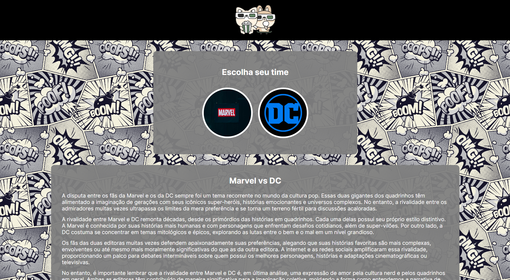

<h1 align="center"> CineTeam </h1>

<p align="center">
  CineTeam é um site para cinéfilos fãs de filmes da Marvel ou DC<br/>
</p>

<p align="center">
  <a href="#-tecnologias">Tecnologias</a>&nbsp;&nbsp;&nbsp;|&nbsp;&nbsp;&nbsp;
  <a href="#-instalação-do-projeto">Instalação do projeto</a>&nbsp;&nbsp;&nbsp;|&nbsp;&nbsp;&nbsp;
  <a href="#-sobre-o-projeto">Sobre o Projeto</a>&nbsp;&nbsp;&nbsp;
</p>

<p align="center">
  
</p>

<p align="center">
  <a href="https://vs12-front-05-styled-component-task-01.vercel.app/" target="_blank">➡️ Acesse o deploy!</a>
</p>

## 🚀 Tecnologias

Esse projeto foi desenvolvido com as seguintes tecnologias:

- React
- Typescript  

## ⚙️ Instalação do projeto

Passo-a-passo:

1. Comandos necessários para executar:

```
npm i
npm start
```

2. Comandos necessários para testar:

```
npm test
```

> O projeto é uma aplicação web e é necessário um navegador web para executá-lo.

## 💻 Sobre o Projeto

O projeto é uma aplicação web onde você pode escolher seu time: Marvel ou DC, ao escolher seu time a página atualiza o tema para o do time selecionado.